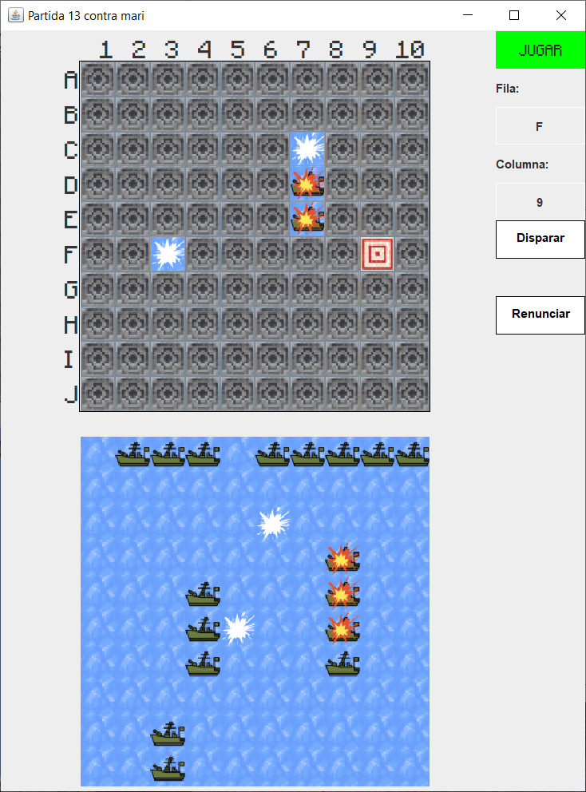

# Hundir la Flota - Cliente y Servidor

Este proyecto es una implementación del juego "Hundir la Flota" (Batalla Naval) en Java, utilizando sockets bajo la arquitectura cliente-servidor. Incluye una interfaz gráfica para el cliente desarrollada en Java Swing, y una base de datos MySQL para gestionar la autenticación y el historial de partidas. El cliente y el servidor se comunican a través de cadenas de texto usando streams de entrada y salida.



## Características

- **Autenticación de usuario**: Los clientes envían un usuario y contraseña al servidor para autenticarse. Si el usuario no existe, el servidor rechaza la conexión.
- **Conexión única por usuario**: Cada usuario solo puede conectarse una vez al servidor.
- **Funciones para el usuario**:
  1. Iniciar una nueva partida contra otro usuario.
  2. Revisar partidas ya finalizadas y reproducirlas paso a paso.
  3. Ver y participar en partidas sin terminar en las que sea su turno.
  4. Renunciar en cualquier momento, cediendo la victoria al contrincante.
- **Persistencia del estado de la partida**: El servidor almacena el estado de las partidas en la base de datos tras cada jugada, permitiendo su recuperación en caso de caída.
- **Sincronización**: El servidor gestiona el turno de los jugadores y asegura que ambos usuarios tengan el estado actualizado en tiempo real.
- **Interfaz gráfica**: El cliente utiliza Java Swing para permitir al usuario colocar barcos y realizar disparos de manera visual.
- **Notificaciones de conexión y desconexión**: Los clientes son notificados si su contrincante se conecta o desconecta, actualizando la lista de partidas de acuerdo a la situación.

## Tecnologías utilizadas

- **Lenguaje**: Java
- **GUI del Cliente**: Java Swing
- **Base de datos**: MySQL
- **Comunicación Cliente-Servidor**: Sockets (streams de entrada y salida de texto)

## Estructura del Proyecto

- **Servidor**: Gestiona la autenticación, la lógica de las partidas, la seguridad, y sincroniza la información entre los clientes.
- **Cliente**: Interfaz gráfica que permite a los usuarios colocar barcos, hacer movimientos, y recibir actualizaciones en tiempo real.

## Instalación

### 1. Configuración de la base de datos MySQL

1. Crea una base de datos MySQL mediante el script proporcionado (base_de_datos/script.sql), en Workbench o similar.

### 2. Configuración del Servidor

1. Clona el repositorio:
   ```bash
   git clone https://github.com/omarmoy/Kinetia-App
   ```

2. Configura las credenciales de la base de datos MySQL así como la URL en el archivo GestionDatos.java
   
3. Configura el puerto de escucha en MainServer.java si es necesario, por defecto está el 2000. 

7. Compila y ejecuta el servidor.

### 2. Configuración del Cliente

1. Configura el host y el puerto en el archivo ConexiónConServidor.java, por defecto estan configurados en "localhost" y 2000 respectivamente. Si vuestra base de datos está en local y tenéis libre el puerto 2000 no hace falta hacer este paso, tened en cuenta que el puerto ha de ser el mismo en el cliente y en el servidor. 

2. Compila y ejecuta el servidor.

## Ejecución

1. Primero, inicia el servidor.
2. Luego, ejecuta tantos clientes como quieras.
3. Identificate en el cliente con un usuario y contraseña de ejemplo, que podrás encontrar en el archivo base_de_datos/usuariosLogin.txt

## Uso

Una vez que el cliente se conecta y autentica en el servidor, puede:

1. **Iniciar Partida Nueva**: Ver una lista de otros jugadores conectados y seleccionar un contrincante.
2. **Ver Partidas Finalizadas**: Revisar partidas terminadas y reproducirlas.
3. **Ver Partidas Activas**: Acceder a sus partidas en curso, disparar si es su turno, o renunciar.
4. **Interacción en tiempo real**: Recibir notificaciones cuando un contrincante se conecta o desconecta, o cuando realiza una jugada.

### Estado de las Partidas

El cliente muestra tres listas de partidas en progreso:

1. **Partidas con el contrincante conectado**: Indicadas en color verde cuando es el turno del usuario, y en rojo cuando es el turno del contrincante.
2. **Partidas sin el contrincante conectado (turno del usuario)**.
3. **Partidas sin el contrincante conectado (turno del contrincante)**.

## Sincronización y Seguridad

- **Sincronización**: El servidor actualiza el estado de la partida tras cada disparo, y notifica a ambos clientes si están conectados.
- **Persistencia de datos**: En caso de desconexión de cliente o caída del servidor, el estado de las partidas permanece guardado en la base de datos para permitir su recuperación.

## Consideraciones Adicionales

- **Transmisión de datos**: El servidor solo envía la información mínima y necesaria para que el cliente pueda jugar, sin mostrar la ubicación de los barcos del oponente.
- **Interfaz gráfica**: Los usuarios colocan sus barcos y disparan en un tablero gráfico, diseñado en Java Swing.

